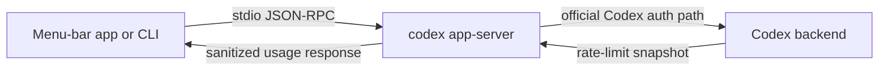
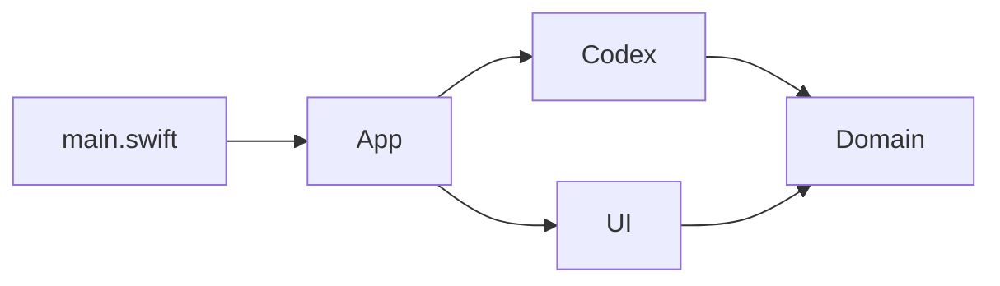

# Architecture

## Goal

Display Codex quota status where it is visible at a glance:

- 5-hour usage window
- weekly usage window
- reset times
- manual refresh state

## Data flow



## JSON-RPC method

The project calls:

```json
{"method":"account/rateLimits/read","id":2}
```

The relevant response fields are:

- `rateLimits.primary.usedPercent`
- `rateLimits.primary.windowDurationMins`
- `rateLimits.primary.resetsAt`
- `rateLimits.secondary.usedPercent`
- `rateLimits.secondary.windowDurationMins`
- `rateLimits.secondary.resetsAt`
- `rateLimitsByLimitId.codex` when present

The UI displays remaining percent as `100 - usedPercent`.

## Source layers

The native macOS app is intentionally split by responsibility:

- `App/`: AppKit lifecycle, menu actions, refresh timing, and settings display.
- `Codex/`: the only layer that starts `codex app-server --listen stdio://`.
- `Domain/`: response decoding and remaining-quota normalization.
- `UI/`: double-ring and large-readout badge rendering.



This keeps the safety boundary reviewable: the UI layer never reads credentials, browser state, screenshots, or network APIs.

## Why not patch Codex.app?

Patching the packaged desktop app breaks the official app signature and ASAR integrity model. That is brittle, hard to share safely, and can cause launch crashes. This repository only builds its own companion menu-bar app and leaves the official Codex bundle untouched.
