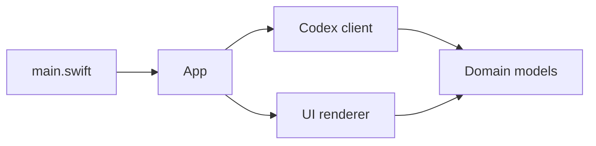

# Project Structure

This repository is organized as a small, native macOS companion app plus a Node.js probe used for tests and diagnostics.

## Top-level layout

- `macos/CodexUsageStatus/`: native Swift/AppKit menu-bar app.
- `src/`: Node.js CLI probe for the same local Codex app-server data source.
- `test/`: Node.js unit tests for response normalization and redaction.
- `scripts/`: build, run, install, and release packaging scripts.
- `docs/`: architecture, release, and upstream integration notes.
- `.github/workflows/`: CI and release packaging workflows.

Generated output is intentionally kept out of git:

- `dist/`: local `.app` and release ZIP output.
- `macos/CodexUsageStatus/.build/`: SwiftPM build cache.
- `node_modules/`: local Node dependencies if any are added later.

## macOS source layout

`macos/CodexUsageStatus/Sources/CodexUsageStatus/` is split by responsibility:

- `main.swift`: process entry point and `--once` diagnostic mode.
- `App/`: AppKit status item lifecycle, menu actions, refresh scheduling, and configuration.
- `Codex/`: local `codex app-server --listen stdio://` JSON-RPC client.
- `Domain/`: decoded rate-limit response models and remaining-quota normalization.
- `UI/`: menu-bar badge styles and drawing code.

The intended dependency direction is:

`Codex/` should remain the only layer that knows how to start the local Codex app-server. `UI/` should only receive normalized usage data and should never access credentials, files, browser state, or network APIs directly.
